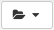
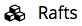

# Documentation

Below are instructions for working with the data on the [Renaissance Simulation Laboratory](https://girder.rensimlab.xyz/). A brief listing of the data available on the RSL can be found at [Investigate](investigate.html).
## Logging into the RSL

### Account Creation
If this is your first time on the [RSL](https://girder.rensimlab.xyz/), you'll need to create an account. Move your mouse over to the top-right corner and click on the [Register](https://girder.rensimlab.xyz/#?dialog=register) link that will appear. If you can't find it, you can register [here](https://girder.rensimlab.xyz/#?dialog=register). You can create a new username and password or login with your [Globus](https://www.globus.org/) or [Github](https://github.com/) account.

### Logging In
Once you have an account, login by moving hte mouse over to the top-right corner and clicking on the [Log In](https://girder.rensimlab.xyz/#?dialog=login) link. If you can't find it, you can login [here](https://girder.rensimlab.xyz/#?dialog=login).

## Browsing and downloading the Renaissance Simulation data

### Browsing
Once you are logged into the RSL, click in the [Collections](https://girder.rensimlab.xyz/#collections) link in the menu on the left. Click on the [Renaissance Simulations](https://girder.rensimlab.xyz/#collection/59b04a0e38eed90001dcc45b) collection. Navigate through the folders by clicking on the links.

[Here](investigate.html) is a list of all existing simulation data. Currently, only the last snapshot for each simulation is hosted on the RSL. If you would additional snapshots, please contact us and we will make them available.

### Downloading

The entire Renaissance Simulation collection can be downloaded by clicking on this  dropdown menu on the right and selecting `Download collection`.

From within a folder, the contents of that folder can be downloaded by clicking on the  folder dropdown menu on the right and selecting `Download folder`.

## Running the tutorial

To run the merger tree tutorial, click on the  link in the menu on the left. Select [Merger Tree Tutorial](https://girder.rensimlab.xyz/#raft/5a860be19f31db0001782590/run) and follow the instructions there.
