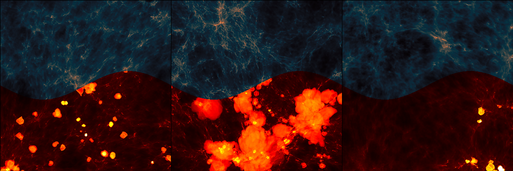
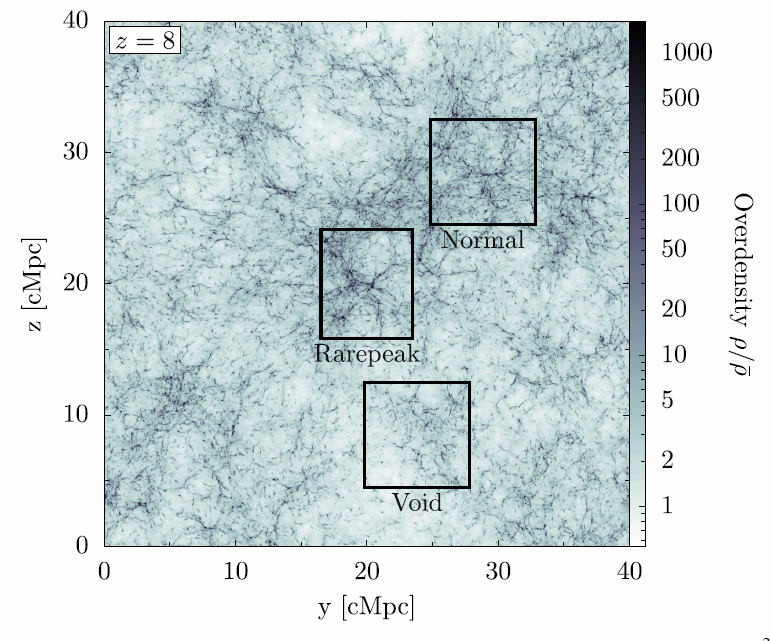

## The Renaissance Simulation Laboratory

## Welcome to the Renaissance Simulation Laboratory!

The Renaissance Simulations are a series of highly sophisticated computer
simulations of galaxy formation in the early Universe. These simulations
were run on the [Blue Waters](https://bluewaters.ncsa.illinois.edu/)
supercomputer at the [National Center for Supercomputing
Applications](http://www.ncsa.illinois.edu/) and produced more than 50 TB
of raw data and other data products, such as halo catalogs, merger trees,
and mock observations. The Renaissance Simulation Laboratory (RSL) provides
open access to all of this data, through both direct download and live
analysis using [Jupyter](http://jupyter.org/) notebooks.

Here's what you'll find at the RSL:

 - [**Learn**](learn.html): If you're new to galaxy formation and
   computational astrophysics, the [Learn](learn.html) section
   covers the basics of these topics.

 - [**Investigate**](investigate.html): Go here for access to the Renaissance
   Simulation data and to begin your analysis.

 - [**Showcase**](showcase.html): See a gallery of images, movies, and papers
   created with Renaissance Simulation data.

 - [**User Guide**](user_guide.html): Here you'll find more information
   on how to access and analyze Renaissance Simulation data.

## About the Renaissance Simulations
<figure style="display: table; float: right; margin: 0 0 20px 20px;">

<figcaption style="display: table-caption; caption-side: bottom;">
Mass-weighted density projection of the (40 comoving Mpc)^3 survey volume, showing the locations of the 
Rarepeak, Normal, and Void zoom-in regions. 
</figcaption>
</figure>

The Renaissance Simulations simulate high redshift galaxy formation in three zoom-in regions 
within a single comoving volume 40 Mpc on a side: a high density region "Rarepeak", 
a region of average density "Normal", and a low density region "Void". The image illustrates this. 
Multiple simulations of each region were carried out varying the treament of the Lyman-Werner 
UV radiation which influences the molecular hydrogen chemistry and cooling in primordial minihalos. 
The choices are:
- LWB: Lyman-Werner background from Population III stars outside the simulated volume
- LW3: Lyman-Werner radiation from Pop III stars inside the simulated volume
- LW2: Lyman-Werner radiation from Population II star clusters inside the simulated volume

The simulations are listed in the table, and use these options in combination as indicated.
All simulations were performed with the publicly available [Enzo code](http://enzo-project.org) on
the [Blue Waters supercomputer](https://bluewaters.ncsa.illinois.edu/blue-waters-overview) over a 3-year period (2013-2015). 
More technical details of the simulations can be found [here](sim_details.html).

