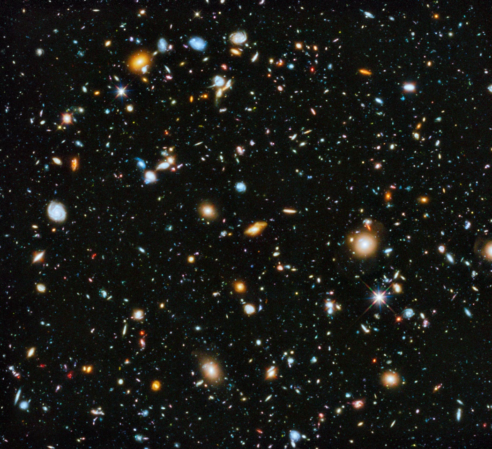
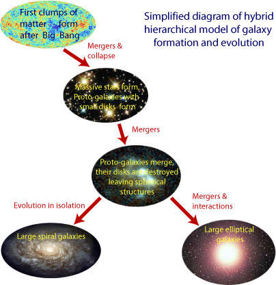
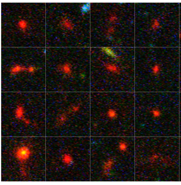
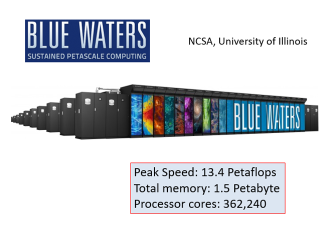
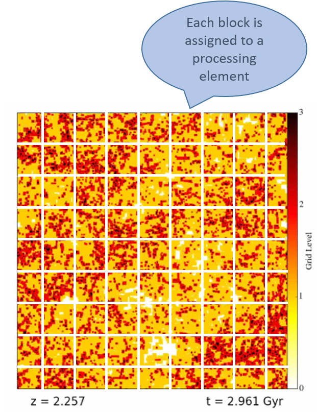
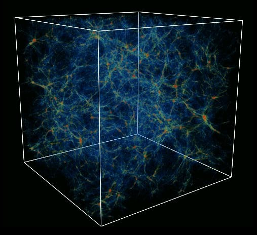
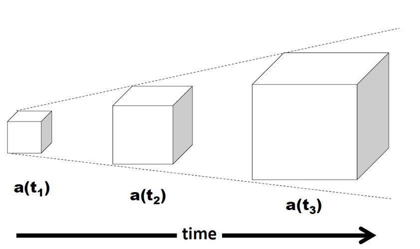
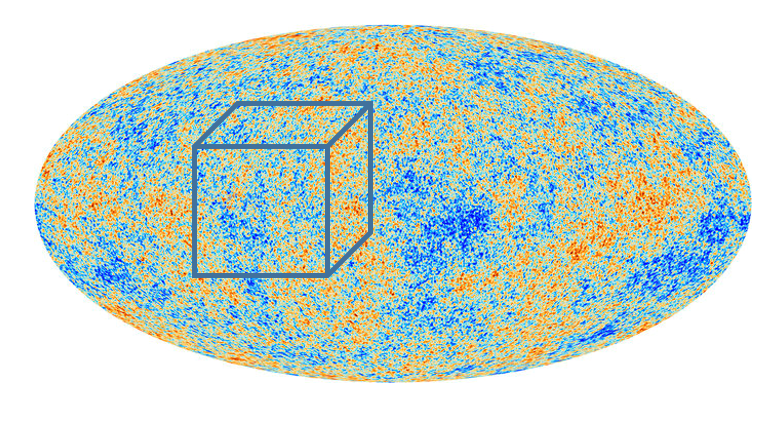
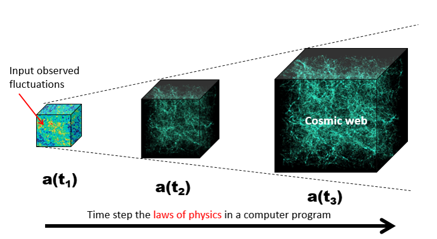
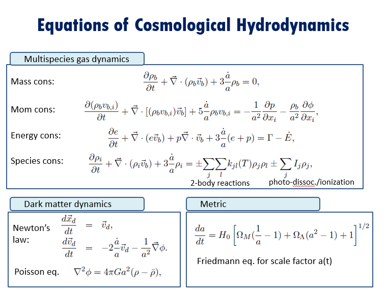

# Learn

This is where you can learn about the first galaxies in the universe, how we can
use supercomputers to study them, and what this site enables you to do.

 * [Learn about the first galaxies in the universe](https://rensimlab.github.io/learn.html#the-first-galaxies-in-the-universe)

 * [Learn about how we use supercomputers to study them](https://rensimlab.github.io/learn.html#how-we-use-supercomputers-to-study-the-first-galaxies)

 * [Learn about the Renaissance Simulations Laboratory](https://rensimlab.github.io/learn.html#about-the-renaissance-simulations-laboratory-rsl)

# The first galaxies in the universe

## Then and now

<figure style="display: table; float: right; margin: 0 0 20px 20px;">

<figcaption style="display: table-caption; caption-side: bottom;">
The Universe at t=13,800,000,000 yr (credit) (learn more)
</figcaption>
</figure>

The universe is filled with countless galaxies today. But there was a time not
long after the big bang when there were no galaxies at all—just tiny
fluctuations in the density of matter. How does a featureless universe “grow
galaxies”? And how do they differ from modern galaxies like the Milky Way?

<figure style="display: table; float: left;">

<figcaption style="display: table-caption; caption-side: bottom;">
The Universe at t=380,000,000 yr (credit) (learn more)
</figcaption>
</figure>

## Growing Galaxies

<figure style="display: table; float: right; margin: 0 0 20px 20px;">

<figcaption style="display: table-caption; caption-side: bottom;">
(credit) (learn more)
</figcaption>
</figure>

Gravity collects regions of slight overdensity in the early universe into dense
clumps of gas and dark matter cosmologists call halos. These halos merge and
coalesce to form the first galaxies (protogalaxies). As time goes on,
protogalaxies merge and coalesce into larger galaxies, and so on, until today we
have a variety of galaxy types and sizes. These include large spiral galaxies
like the Milky Way, and large elliptical galaxies, like M87. Thus, galaxies are
said to grow hierarchically, with large modern galaxies representing the
assembly of thousands of protogalaxies which are much smaller.

## Observing the First Galaxies

<figure style="display: table; float: right; margin: 0 0 20px 20px;">

<figcaption style="display: table-caption; caption-side: bottom;">
(credit) (learn more)
</figcaption>
</figure>

Can we observe the first galaxies directly? No. They are too small and too faint
for the Hubble Space Telescope (HST) to detect them. However the HST can detect
very faint, distant galaxies which are likely second and third generation
galaxies. The graphic at right shows how deep the HST has been able to probe.
The Hubble Ultra Deep Field  has detected galaxies when the universe was only6400-700 million years old, which is only a few percent of its present agThe James Webb Space Telescope, to be launched by NASA in 2018, should be able
to observe even younger galaxies, pushing into the realm of truly first
galaxies.

## Faint Red Blobs at the Edge of the Universe

<figure style="display: table; float: right; margin: 0 0 20px 20px;">

<figcaption style="display: table-caption; caption-side: bottom;">
(credit) (learn more)
</figcaption>
</figure>

While not strictly the first galaxies in the universe, the most distant galaxies
detected by the HST are worthy of study. They appear as faint red blobs in the
Hubble Ultra Deep Field. They are red because the expansion of the universe has
redshifted their starlight into the red part of the visible spectrum. They are
faint because they are distant. And they are very small compared to the Milky
Way galaxy. A typical size is about 500 parsec, which is 1/50 the size of the
Milky Way galaxy.

# How we use supercomputers to study the first galaxies

Before we delve into how we use supercomputers to study the first galaxies, we need
to cover some basics. 

## Supercomputers
<figure style="display: table; float: right; margin: 0 0 20px 20px;">

<figcaption style="display: table-caption; caption-side: bottom;">
(credit) (learn more)
</figcaption>
</figure>

Supercomputers are large clusters of processing “nodes” all connected together by 

a fast network so that it can act like a single, very powerful computer. Each node 
can have dozens of processing “cores”. For example, The Blue Waters supercomputer, 
used for the Renaissance Simulations, has over 22,640 nodes, each with 16 cores, for 
a total of 362,240  processing elements. 

## Parallel computing
<figure style="display: table; float: right; margin: 0 0 20px 20px;">

<figcaption style="display: table-caption; caption-side: bottom;">
(credit) (learn more)

</figcaption>
</figure>

Supercomputers are programmed using a technique called parallel computing. Quite 
simply, a large problem (like computing the universe) is subdivided into many smaller 
problems (like compute this piece of the universe), and each smaller problem is assigned 
to one of the computing cores or nodes. All these smaller problems are computed 
simultaneously, or “in parallel”, with information about their state being continuously 
communicated to neighboring processors in order to maintain physical correctness and 
synchronicity. Typically, the subdivision of the big problem into many smaller problems 
is done using domain decomposition, illustrated at right.  

## Coping with an infinite universe
<figure style="display: table; float: right; margin: 0 0 20px 20px;">

<figcaption style="display: table-caption; caption-side: bottom;">1(credit) (learn more)
</figcaption>
</figure>

Obviously, we cannot fit an infinite universe into a finite computer, however large and 
powerful. Instead, we simulate a chunk of the universe that is large enough to have lots 
of interesting things in it (galaxies, clusters, superclusters, etc.) In practice, we 
adjust the size of the chunk according to what we are interested in. For example, if we 
are interested in superclusters, which are far larger than individual galaxies, then we 
would simulate a larger chunk of the universe than if we were only interested in an individual 
galaxy. The shape of the chunk is taken to be a cube for computational convenience. We assume 
period boundary conditions in all three dimensions to mimic the presence of matter outside 
the box we are simulating. 

## Coping with an expanding universe

<figure style="display: table; float: right; margin: 0 0 20px 20px;">

<figcaption style="display: table-caption; caption-side: bottom;">
(credit) (learn more)
</figcaption>
</figure>

Hubble discovered the universe is expanding in 1929. What that means is that every point in 
the universe is moving away from every other point in the universe with uniform speed. That 
speed varies with time, and also depends on how far apart the two points are. While this 
seems a little boggling, just think about the raisins in a lump of raisin bread dough. As the 

dough rises, the raisins behave just as described above. But how to simulate a cube of matter 
embedded in an expanding universe? Easy. We simulate a cube of the universe that expands at 
exactly the rate of the expanding universe. We say we simulate a co-moving volume of the universe. 

## Initializing the simulation
<figure style="display: table; float: right; margin: 0 0 20px 20px;">

<figcaption style="display: table-caption; caption-side: bottom;">
(credit) (learn more)
</figcaption>
</figure>

We have already learned that through detailed observations of the cosmic microwave background, 
we know what the universe was like 380,000 years after the big bang. We use that information 
to initialize our simulations. Specifically we know that the matter in the universe was very 
homogenous, with only slight ripples imposed that create regions of slight overdensity and 
underdensity. We call these matter fluctuations. The amplitude and power spectrum of these matter 
fluctuations has been precisely measured by the Planck satellite. Generally, we do not start the 
simulation at t=380,000 yr, but some millions of years later. Using linear perturbation theory, 
we are able to adjust the amplitude accordingly, however the power spectrum remains the same. 

## Computing what happens next
<figure style="display: table; float: right; margin: 0 0 20px 20px;">

<figcaption style="display: table-caption; caption-side: bottom;">
(credit) (learn more)
</figcaption>
</figure>

Fortunately, the physical laws that governs what happens next are well understood. We program 
these physical laws into a parallel computer program, and step the physical state of the universe 
along in a number of discrete steps, called timesteps. A cosmological simulation can have anywhere 
from a few thousand timesteps to over 100,000 timesteps, depending on how far into cosmic history 
you want to simulate, and how finely resolved the simulation is. 

## What physical laws are programmed?
<figure style="display: table; float: right; margin: 0 0 20px 20px;">

<figcaption style="display: table-caption; caption-side: bottom;">
(credit) (learn more)
</figcaption>
</figure>

The physical laws are expressed as differential equations, both ordinary 
and partial, which govern the time evolution of the matter and energy in
the simulation. Specifically, the following processes are included:
* Uniform by time-varying expansion of the universe as a whole
* Dynamical behavior of dark matter under the action of self-gravity
* Dynamical, thermodynamical, and ionization behavior of the hydrogen and helium gas left over from the big bang
* Chemistry and radiative cooling of the gas and condensation of stars out of the coldest gas
* Feedback of energy, radiation, and heavy elements from stars 
* Feedback of high energy radiation from accreting stellar remnants 
* Transport of photoionizing and photodissociating radiation

## Ok, so what happens?
The narrated animation below shows what happens when all this physics is put into a 
supercomputer, and let loose for hundreds of millions of cosmic years, and millions of 
computer-hours. First stars form, which explode as supernovae after a few million years, 
setting the stage for the formation of protogalactic building bocks. The merge due to gravity 
to form the first galaxies in the universe. Voila! 

<iframe width="560" height="315" src="https://www.youtube.com/embed/IKUGyy6DoTE" frameborder="0" allowfullscreen></iframe>

# About the Renaissance Simulations Laboratory (RSL)

## Purpose
The RSL is open data resource where the Renaissance Simulations data can be browsed, accessed, and analyzed. The site supports visual data exploration, data download, as well as interactive analysis through the use of Jupyter notebooks. The site is also a place for sharing your scientific analysis and results. 

## How to use
The RSL is organized into 5 departments according to your goals: 
 * [LEARN](https://github.com/rensimlab/rensimlab.github.io/blob/master/learn.md) – learn about the first galaxies, how we use supercomputers to understand them, and the purpose and uses for the RSL
 * [EXPLORE](https://github.com/rensimlab/rensimlab.github.io/blob/master/explore.md) – visually explore the Renaissance Simulations using a set of pre-built tools
 * [INVESTIGATE](https://github.com/rensimlab/rensimlab.github.io/blob/master/investigate.md) – download or analyze the data using the yt tookit
 * [DEVELOP](https://github.com/rensimlab/rensimlab.github.io/blob/master/develop.md) – add new data or tools to the RSL
 * [SHOWCASE](https://github.com/rensimlab/rensimlab.github.io/blob/master/showcase.md) – showcase your results through image galleries, animations, or publications
Click on any link to go there. General documentation can be found here.

# Acknowledgements 
The RSL is partially supported by NSF CDS&E grant 1615848, with additional resources provided by the [San Diego Supercomputer Center](http://www.sdsc.edu) and the [National Center for Supercomputing Applications](http://www.ncsa.illinois.edu). 

