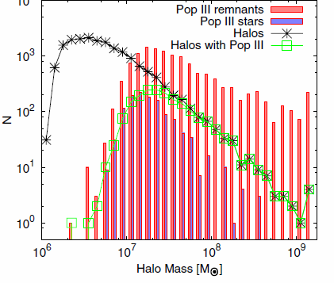
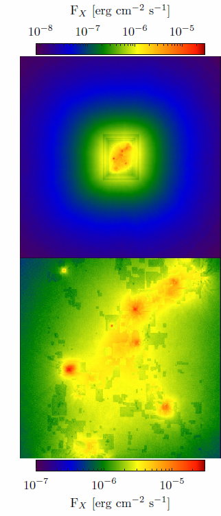
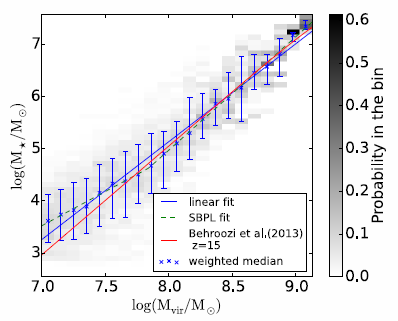
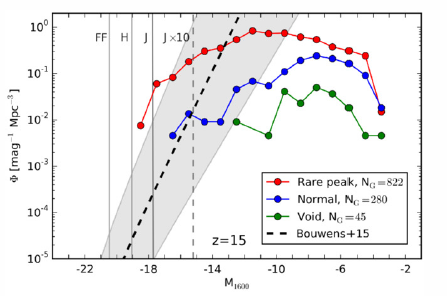
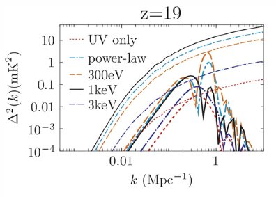
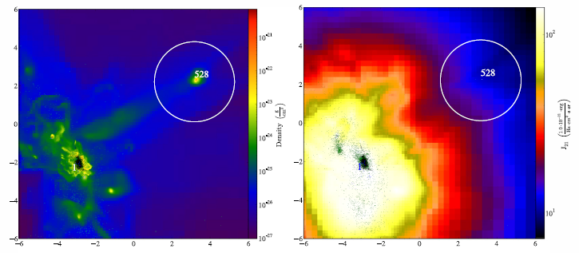
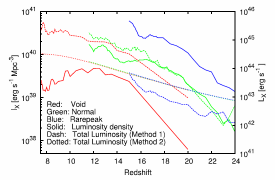
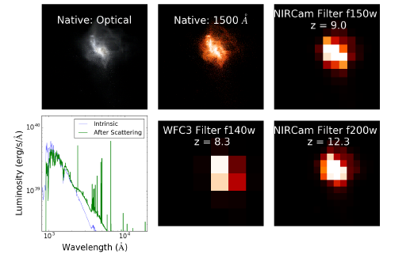
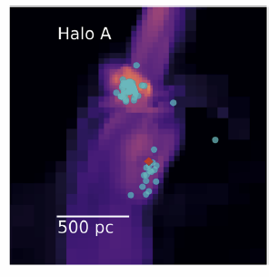

# Showcase

## Publications using the Renaissance Simulations

### POPULATION III STARS AND REMNANTS IN HIGH-REDSHIFT GALAXIES
#### Hao Xu, John H. Wise, and Michael L. Norman, ApJ, 773:83, 2013

<figure style="display: table; float: right; margin: 0 0 20px 20px;">

<figcaption style="display: table-caption; caption-side: bottom;">
</figcaption>
</figure>

In [Xu et al. 2013](http://adsabs.harvard.edu/abs/2013ApJ...773...83X) the Rarepeak simulation is explored for the occurence of Pop III stars and their stellar remnants. The figure shows the number of active Pop III stars and remnants as a function of halo mass at z=15. As expected, the more massive the halo, the more Pop III remnants it contains. The most massive halos contain nearly 100 remnants but only a few active Pop III stars. 

### HEATING THE INTERGALACTIC MEDIUM BY X-RAYS FROM POPULATION III BINARIES IN HIGH-REDSHIFT GALAXIES
#### Hao Xu, Kyungjin Ahn, John H. Wise, Michael L. Norman, and Brian W. O’Shea, ApJ, 791:110, 2014

<figure style="display: table; float: left; margin: 0 0 20px 20px;">

<figcaption style="display: table-caption; caption-side: bottom;">
</figcaption>
</figure>

If one assumes a fraction of Pop III stellar remnants high mass x-ray binaries [Xu et al. 2014](http://adsabs.harvard.edu/abs/2014ApJ...791..110X) calculate the x-ray feedback on the intergalactic medium (IGM) in the Rarepeak simulation. On average, the x-rays heat the IGM by 100 K, but much higher in the vicinity of the Rarepeak.

### SCALING RELATIONS FOR GALAXIES PRIOR TO REIONIZATION
#### Pengfei Chen, John H. Wise, Michael L. Norman, Hao Xu, and Brian W. O’Shea, ApJ, 795:144, 2014

<figure style="display: table; float: right; margin: 0 0 20px 20px;">

<figcaption style="display: table-caption; caption-side: bottom;">
</figcaption>
</figure>

[Chen et al. 2014](http://adsabs.harvard.edu/abs/2014ApJ...795..144C) examine statistical correlations amongst many baryonic and dark matter properties of interest in a sample of high redshift galaxies in the Rarepeak simulation. These correlations can be used to build semi-analytic models of the formation of early galaxies. 

### PROBING THE ULTRAVIOLET LUMINOSITY FUNCTION OF THE EARLIEST GALAXIES WITH THE RENAISSANCE SIMULATIONS
#### Brian W. O’Shea, John H. Wise, Hao Xu, and Michael L. Norman, ApJLett, 807:L12, 2015

<figure style="display: table; float: left; margin: 0 0 20px 20px;">

<figcaption style="display: table-caption; caption-side: bottom;">
</figcaption>
</figure>

[O'Shea et al. 2015](http://adsabs.harvard.edu/abs/2015ApJ...807L..12O) calculate the ultraviolet luminosity function for thousands of high redshift galaxies in the Rarepeak, Normal, and Void simulations, and predict a flattening at the faint magnitude end. The flattening is caused by the fact that below halo masses of around 3 x 10^8 solar masses, star formation is not continuous, reducing the average amount of UV radiation produced per galaxy at the faint end of the luminosity function.  

### SPATIALLY EXTENDED 21 cm SIGNAL FROM STRONGLY CLUSTERED UV AND X-RAY SOURCES IN THE EARLY UNIVERSE
#### Kyungjin Ahn, Hao Xu, Michael L. Norman, Marcelo A. Alvarez, and John H. Wise, ApJ, 802:8, 2015

<figure style="display: table; float: left; margin: 0 0 20px 20px;">

<figcaption style="display: table-caption; caption-side: bottom;">
</figcaption>
</figure>10

[Ahn et al. 2015](http://adsabs.harvard.edu/abs/2015ApJ...802....8A) calculate the high redshift 21 cm signal resulting from the x-ray heating of the IGM modeled by Xu et al. (2014) as discussed above. The signal depends on the x-ray source model, but in the most optimistic scenario is detectable with the future Square Kilometer Array (SKA). The figure above shows the z=19 21 cm brightness temperature power spectrum for different x-ray source energies. 
### LATE POP III STAR FORMATION DURING THE EPOCH OF REIONIZATION: RESULTS FROM THE RENAISSANCE SIMULATIONS
#### Hao Xu, Michael L. Norman, Brian W. O'Shea, and John H. Wise, ApJ, 823:140, 2016

<figure style="display: table; float: left; margin: 0 0 20px 20px;">

<figcaption style="display: table-caption; caption-side: bottom;">
</figcaption>
</figure>

[Xu et al. 2016a](http://adsabs.harvard.edu/abs/2016ApJ...823..140X) examine the history of Pop III star formtion in the Void Renaissance Simulation, and find that it continues at a low rate to z=7.6, the lowest redshift achieved. Pop III star formation is able to continue despite the Lyman-Werner radiation from early galaxies in pristine pockets of gas.    

### X-RAY BACKGROUND AT HIGH REDSHIFTS FROM POP III REMNANTS: RESULTS FROM POP III STAR FORMATION RATES IN THE RENAISSANCE SIMULATIONS
#### Hao Xu, Kyungjin Ahn, Michael L. Norman, John H. Wise, and Brian W. O'Shea, ApJLett, 832:L5, 2016

<figure style="display: table; float: left; margin: 0 0 20px 20px;">

<figcaption style="display: table-caption; caption-side: bottom;">
</figcaption>
</figure>

[Xu et al. 2016b](http://adsabs.harvard.edu/abs/2016ApJ...832L...5X) calculate the x-ray background produced by Pop III stellar remnants, taking as input the extended Pop III star formation history presented in Xu et al. (2016a), and assuming a fair fraction of the stellar remnants are high mass x-ray binaries. It is found that Pop III stars can make a substantial contribution to the x-ray background. 

### GALAXY PROPERTIES AND UV ESCAPE FRACTIONS DURING THE EPOCH OF REIONIZATION: RESULTS FROM THE RENAISSANCE SIMULATIONS
#### Hao Xu, John H. Wise, Michael L. Norman, Kyungjin Ahn, and Brian W. O'Shea, ApJ, 833:84, 2016

<figure style="display: table; float: left; margin: 0 0 20px 20px;">

<figcaption style="display: table-caption; caption-side: bottom;">
</figcaption>
</figure>

[Xu et al. 2016c](http://adsabs.harvard.edu/abs/2016ApJ...833...84X) present a detailed analysis of the galaxy properties and ionizing escape fraction from the combined Renaissance Simulations galaxy sample (over 10,000 high redshift galaxies).  

### First light: exploring the spectra of high-redshift galaxies in the Renaissance Simulations 
#### Kirk S. S. Barrow, John H. Wise, Michael L. Norman, Brian W. O'Shea, Hao Xu , MNRAS, 469:4863, 2017

<figure style="display: table; float: left; margin: 0 0 20px 20px;">

<figcaption style="display: table-caption; caption-side: bottom;">
</figcaption>
</figure>

[Barrow et al. 2017](http://adsabs.harvard.edu/abs/2017MNRAS.469.4863B) explore the photometric and spectroscopic properties of the galaxies in the Rarepeak Renaissance Simulation, in particular, as observed by the upcoming James Webb Space Telescope. 

### First light – II. Emission line extinction, population III stars, and X-ray binaries  
#### Kirk S S Barrow, John H Wise, Aycin Aykutalp, Brian W O'Shea, Michael L Norman, Hao Xu, MNRAS, 474:2617, 2018

<figure style="display: table; float: left; margin: 0 0 20px 20px;">

<figcaption style="display: table-caption; caption-side: bottom;">
</figcaption>
</figure>

[Barrow et al. 2018](http://adsabs.harvard.edu/abs/2018MNRAS.474.2617B) continue their exploration of the observable properties of high redshift galaxies as predicted by the renaissance Simulations. Here they focus on the spectroscopic features produced by small clusters of Pop III stars, as well as x-ray binaries they may leave behind as remnants.  

