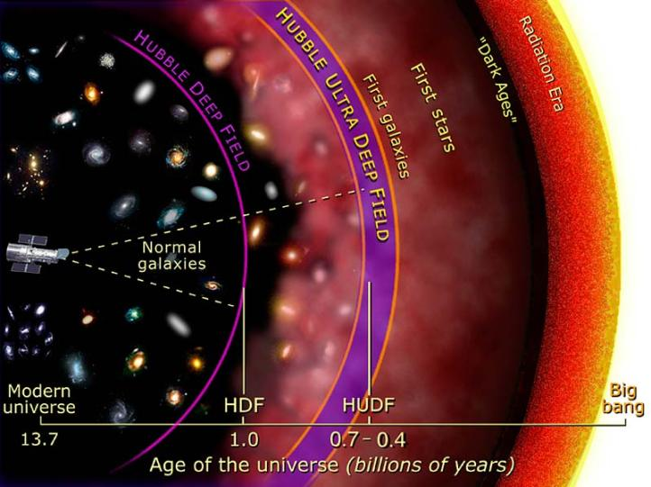

# Showcase

## Publications using the Renaissance Simulations

### Observing the First Galaxies

<figure style="display: table; float: right; margin: 0 0 20px 20px;">

<figcaption style="display: table-caption; caption-side: bottom;">
(credit) (learn more)
</figcaption>
</figure>

Can we observe the first galaxies directly? No. They are too small and too faint
for the Hubble Space Telescope (HST) to detect them. However the HST can detect
very faint, distant galaxies which are likely second and third generation
galaxies. The graphic at right shows how deep the HST has been able to probe.
The Hubble Ultra Deep Field  has detected galaxies when the universe was only6400-700 million years old, which is only a few percent of its present agThe James Webb Space Telescope, to be launched by NASA in 2018, should be able
to observe even younger galaxies, pushing into the realm of truly first
galaxies.

