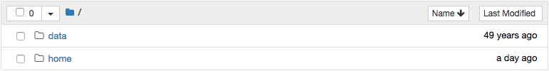
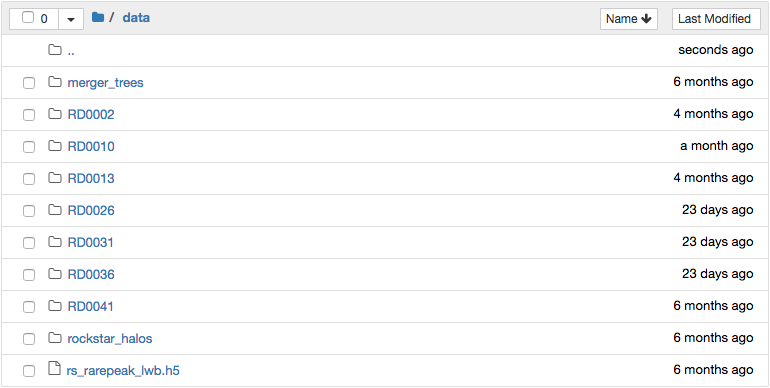
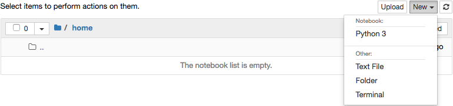
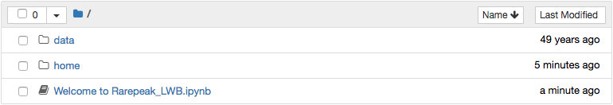
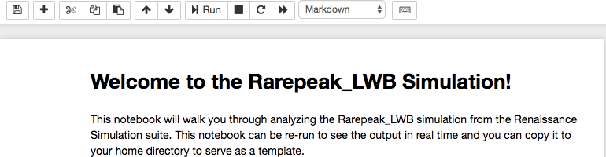

# User Guide

This user guide provides details on the various data products available for
download on the RSL as well as performing analysis on the RSL itself.

## Data Downloads

Snapshots, halo catalogs, and merger trees are available for download for
all of the simulations in the Rnaissance collection. A list of all simulations
is given on the [Investigate](investigate.html) page, with links to tables
of all existing data products. Halo catalogs have been created for every
snapshot and all are immediately available for download. However, due to their
large size (100-200 GB), only a subset of snapshots are currently hosted on the
RSL. Additional snapshots can be made available (for both download and analysis)
upon request, to the limit of available storage space on the RSL webserver.
Clicking the `"request data"` link next to a snapshot will open an email to the
RSL admins with the simulation and snapshot names. An account on the RSL is not
required to download data.

<h3 id="snapshots">Snapshots</h3>

Snapshots contain all gas and particle data for the simulation at a single
instant in time. A snapshot is stored on disk within a single directory,
named something like RD00041, indicating that it's the 42nd redshift-based
output. In this directory is an ascii file containing all runtime parameters,
a series of HDF5 files storing the grid and particle data, and some other
files containing the layout of the adaptive mesh hierarchy and boundary
conditions. These datasets can be
[loaded with yt](http://yt-project.org/docs/dev/examining/loading_data.html#enzo-data)
by providing the path to the parameter file.

```
>>> import yt
>>> ds = yt.load("RD0041/RedshiftOutput0041")
```

<h3 id="halo-catalogs">Halo Catalogs</h3>

Halo catalogs for all snapshots have been created using the
[Rockstar-Galaxies](https://bitbucket.org/pbehroozi/rockstar-galaxies/)
halo finder. This creates two output formats, <a href="#hc-ascii">ascii</a>
and <a href="#hc-binary">binary</a>.

<h4 id="hc-ascii">Ascii</h4>

Ascii-format halo catalogs are named `out_#.list`, where the number is
the n'th dataset run through Rockstar, not necessarily corresponding to
the snapshot with the same number. The file header contains a full
description of the data within.

<h4 id="hc-binary">Binary</h4>

Binary-format halo catalogs consist of a series of files named
`halos_<snapshot name>.#.bin`, there the snapshot name is the directory
name of that snapshot, and the number is the Rockstar processor number.
You will need to keep all of the *.bin files in order to load them.
This data can be
[loaded with yt](http://yt-project.org/docs/dev/examining/loading_data.html#rockstar)
by providing the path to the zero'th file.

```
>>> import yt
>>> ds = yt.load("halos_RD0041.0.bin")
```

<h3 id="merger-trees">Merger Trees</h3>

Merger trees have been created from the Rockstar halo catalogs using
[consistent-trees](https://bitbucket.org/pbehroozi/consistent-trees/).
Two formats are available for download, the raw
<a href="#mt-consistent-trees">consistent-trees</a> output and
<a href="#mt-ytree">ytree</a> format. Both of these can be
[loaded with ytree](http://ytree.readthedocs.io/en/latest/Arbor.html#loading-merger-tree-data).

<h4 id="mt-consistent-trees">consistent-trees</h4>

The consistent-trees file is named `tree_0_0_0.dat` and is an ascii
file. The file header contains a full description of the data and units.
This file can be loaded with `ytree` by doing:

```
import ytree
arbor = ytree.load("tree_0_0_0.dat")
```

<h4 id="mt-ytree">ytree</h4>

The `ytree` format has identical contents to the consistent-trees
file, but is optimized for faster i/o. It consists of a directory
with a series of HDF5 files. The merger trees available on the RSL
have been named according to the simulation from which they were
created, but in all lowercase. They can be loaded by providing the
path to the HDF5 file of the same name:

```
import ytree
arbor = ytree.load("rarepeak_lwb/rarepeak_lwb.h5")
```

<h2 id="analysis">Analyzing on the RSL</h2>

The Renaissance Simulation Laboratory provides a Python environment
with which to analyze all hosted data without needing to download
anything. Computation is performed on the RSL webserver. This is
facilitated by launching a [Jupyter](http://jupyter.org/) notebook
server that has access to both the simulation data and persistent
personal storage. Users can save notebooks and generated data
products in their storage and download them to their local machine.
The Python environment comes equipped with the
[yt](https://yt-project.org/) and [ytree](https://ytree.readthedocs.io/)
analysis packages as well as all of their dependencies, including
[matplotlib](https://matplotlib.org/), [NumPy](https://www.numpy.org/),
and [SciPy](https://www.scipy.org/).

### Account Creation and Login

An account is required for running analysis on the RSL. This account
provides you with persistent storage for scripts and data. The first
time you launch a Jupyter notebook session, you will be prompted
to create a new account, either by providing a username and password
or by authenticating with [Globus](https://www.globus.org/) or
[GitHub](https://github.com/).

<h3 id="launch">Launching Jupyter Notebook Sessions</h3>

Each simulation page contains two links for launching a Jupyter
notebook session. These are located in the top row of the upper
table, in the row labelled `Analyze`. Each of these are discussed
further below. If you are new to Jupyter notebooks, the documentation
can be found [here](https://jupyter-notebook.readthedocs.io/en/stable/).
Hit `Enter` in order to edit a notebook cell and `shift+Enter` to run
that cell.

<h4 id="jupyter">Launch a Jupyter Session</h4>

The link entitled `"Launch Jupyter"` will start a regular Jupyter
notebook server. Clicking this will open a new tab with a file
browser showing two folders, `data` and `home`.



The `data` folder contains all data corresponding to the simulation
to be analyzed. The `home` folder is your storage space. Files stored
in `home` will be available from every Jupyter session you run. Click
on the folder names to navigate into them.



The `data` folder is read-only. Files can be download by clicking the
check box next to them and then clicking the `Download` button that
will appear above. New notebooks should be created from within the
`home` folder. Start a new notebook by going to the `New` menu in
the upper right and selecting `Python 3` under the `Notebook`
heading. It is also possible to open a window with a conventional
terminal by selecting `Terminal`.



Make sure to save your notebook by selecting `"Save and Checkpoint"` in
the `File` menu or by clicking the
<i class="fa fa-save fa-lg fa-fw" title="save me"></i> button. When you
finished, select `"Close and Halt"` from the `File` menu.

<h4 id="tutorial">Launch a Tutorial Session</h4>

The link entitled `"Launch Tutorial"` will start a Jupyter notebook
server with the same setup as the `"Launch Jupyter"` link, except with
a tutorial notebook in your workspace.



Open the notebook by clicking on it.



The code in the welcome notebook can be re-run to reproduce the output
shown by hitting `shift+Enter` in each cell. The welcome notebook can
serve as a template for future analysis. After closing the notebook,
it can be moved to your `home` folder to be saved by clicking the check
box next to it and clicking the `Move` button that will appear above.

## Help!

If you need any additional help, please
<a href="mailto:bds006@sdsc.edu">contact the RSL admins</a>.

## Additional Resources

 - [Jupter notebook documentation](https://jupyter-notebook.readthedocs.io/en/stable/)

 - [yt documentation](http://yt-project.org/docs/dev/)

 - [ytree documentation](http://ytree.readthedocs.io/)

 - [Rockstar-Galaxies](https://bitbucket.org/pbehroozi/rockstar-galaxies/)

 - [consistent-trees](https://bitbucket.org/pbehroozi/consistent-trees/)
 